# MOVIESAPP

## Indice

-   [Descripción](#descripcion)
-   [Estructura del Proyecto](#estructura)
-   [Tecnologías Utilizadas](#tecnologias)
-   [Interfaces](#interfaces)
-   [Features](#features)

## Descripción

Proyecto web donde se **consume de una API información de peliculas y series** y en base a está información obtenida se realiza el **desarrollo Front End.**

## Estructura del proyecto

Se trabajó manteniendo una estructura de carpetas organizadas para mantener la lógica del proyecto para una fácil comprensión y mantenimiento del mismo.

-   **src:** Carpeta contenedora de todo el código fuente
    -   **auth:** En esta carpeta se encuentra todo lo relacionado con la authenticación del usuario. dentro de auth podremos encontrar:
        -   **content:** Aquí se manejan todos los **estados globales en relación a la authenticación**, y además se aprovecha que envuelve a toda la app, y se maneja los **estados para manejar la responsividad** según corresponda el dispositivo utilizado.
        -   **pages:** Aquí se maneja la página a renderizar en este caso solamente la pantalla del **Login** la cual es la única página indexada con una ruta pública.
        -   **types:** Carpeta contenodora de un helper donde se maneja un objeto donde puede tomar dos valores, Login o Logout para manejar las funcionalidades de **login y logout** de forma ordenada.
    -   **movies:** En está carpeta se puede encontrar todo el código fuente a las renderizaciones de las distintas interfaces, la misma se encuentra consituida por:
        -   **context**: Aquí se manejan todos los **estados globales en relación a las distintas informaciónes a mostrar, como peliculas, series, estados para manejar el renderizado dinámico, etc**.
        -   **components:** Se encuentran todos los componentes.
        -   **pages**: Aquí se encuentran las distintas páginar a renderizar.
        -   **routes**: Se configuran las rutas, y dependiendo de ello se renderiza la página correspondiente.
    -   **exceptions:** En está carpeta se encuentra el **manejo de errores**, en este caso **ErrorBoundary** donde si se encuentra algún error en cualquier parte de nuestro sitio nos redirige al **Home**.
    -   **helpers:** Aquí se encuentran todas las funciones que asisten a nuestro desarrollo, como funciones fetch para realizar peticiones a la API, y reducers para manejar estados según corresponda a la acción.
    -   **hooks:** En está carpeta se puede encontrar los customs Hooks.
    -   **router:** Se realizan las configuraciones necesarias para el manejo público y privado de rutas, y se realiza la configuración de ruteos de la misma. quedando como **LoginPage** la única ruta pública, y luego las rutas que se encuentran en **_movies_** privadas, lo que quiere decir que es necesario que el usuario se encuentre logueado.

  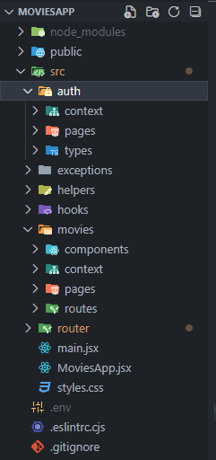

## Tecnologías Utilizadas

El proyecto fue desarrollado utilizando:

-   **_Javascript_** como lenguaje de programación
-   La librería de **_React_** con **_Vite_**
-   Para los estilos, se utilizó el framework de CSS conocido como **_Tailwind CSS_**.

Para el ruteo de páginas se utilizó **_react-router-dom_**, además se manejan rutas públicas y privadas.

## Interfaces

-   ### Login

    -   Desktop:

    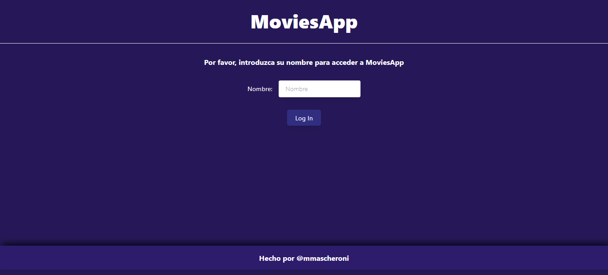

    -   Mobile:

    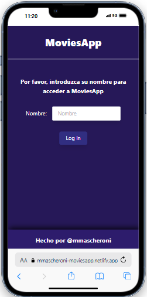

-   ### Home Page

    -   Desktop:

    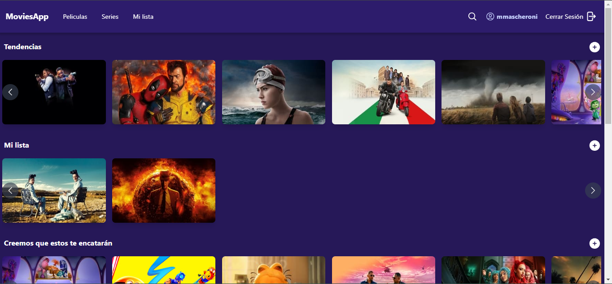

    -   Mobile:

    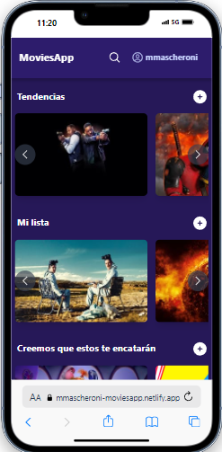
    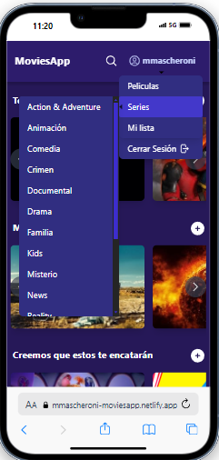

-   ### Title Page

    -   Desktop:

    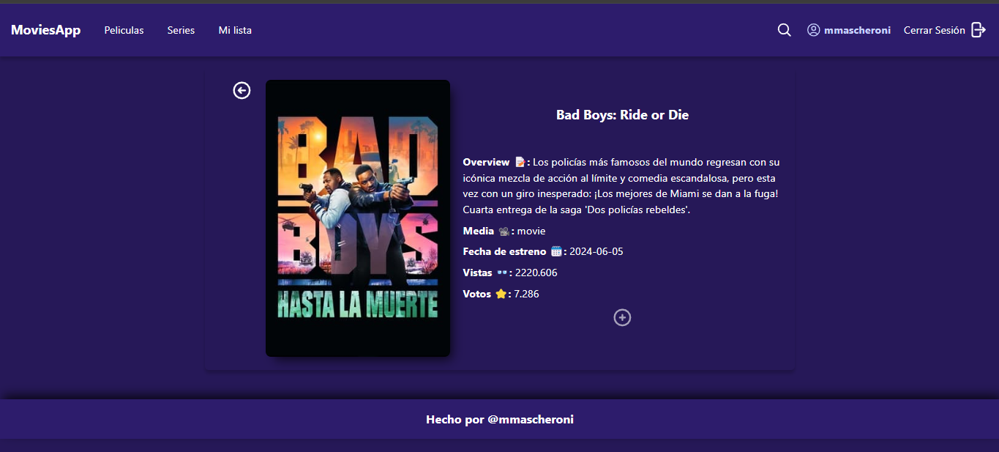

    -   Mobile:

    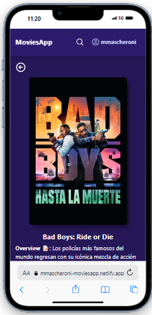

-   ### Search Page

    -   Desktop:

    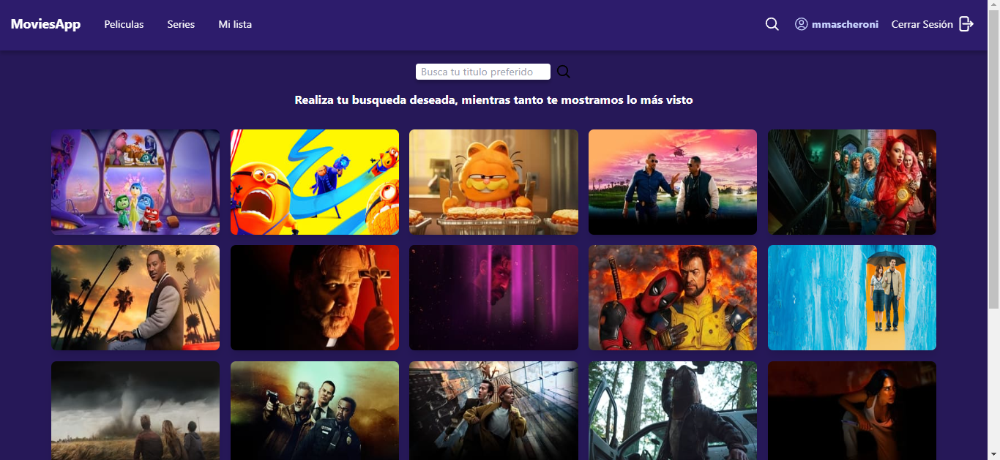

    -   Mobile:

    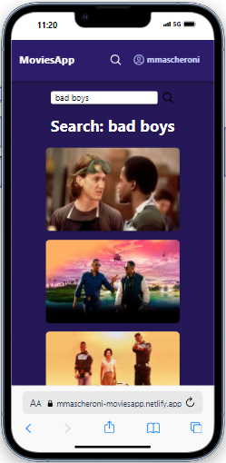

    -   Spinner de carga:

    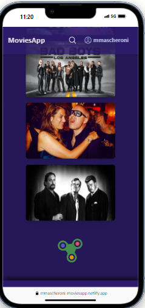

## Features

-   **Agregar Sección de Peliculas Similares** al acceder a una pelicula o serie en particular.
